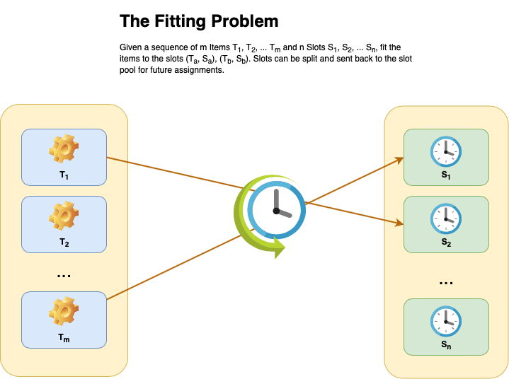

# Karmayoga :calendar:


Karmayoga is a java software for Task Organization with a focus on humans :family: (not machines).

Originally started with the goal of building a simple Java library with an opinionated view of automatic human task organization as a fitting problem, the project aimed to solve daily planning using simple algorithm implementations.

Currently, we plan to extend it to be a fully usable software, integrated with online Calendars, and with possible future UI extensions in scope.

Please refer to the [ADR sections](./docs/adr/index.md) for details on changes to the architecture and major directions of the project.


## Tech Stack
* Java 11
* Gradle 6
* JUnit 5
* Mockito


## Commands

* To build the project use:

```bash
./gradlew build
```

* To run all the tests use:
```bash
./gradlew test
```

## Getting Started

The major entry point to using the library is to understand the `Allocator` interface. It simply codifies the fitting problem stated below as a Java interface. 

If you give any implementation of the `Allocator` interface a sequence of `Task` and a sequence of `TimeSlot` elements, it will try to return back a Sequence of `Schedule` elements which represents a possible fit.

One possible solution approach uses the classic Best Fit, Worst Fit or First Fit algorithms used in Memory allocations, but with some domain specific configurations and implications.


## The Fitting Problem
### Problem Statement
You have a series of TimeSlots (s1, s2, s3, … sn) , wherein each TimeSlot s has a start and end time, and you also have a series of Tasks (t1, t2, t3 … tn), wherein each Task t has an estimated duration d, and a priority p.

You need to fit as many tasks into the given slots as possible such that tasks with highest priority get precedence. In cases where two tasks have same priority, the task with lower estimated duration gets precedence.

**_Note_**: that each TimeSlot has an implied time duration as well.

This representation of the above problem has a more human-centric aspect to it, as it takes into account the 80-20 principle while scheduling tasks for humans.



